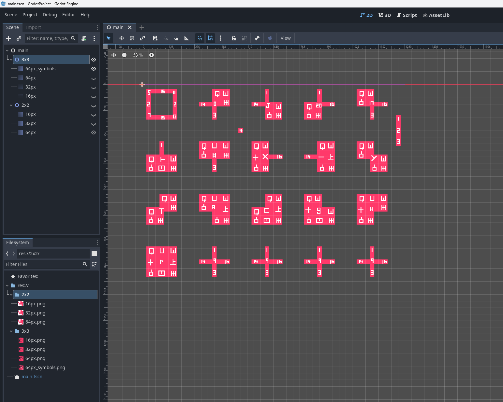

# Godot Tile Templates

Templates for Godot Autotiles.

# How to Use

1. Open the Godot 4 project.
2. Observe the tile maps that are wired up for autotiles.
3. Modify the tile map png images in Aseprite.
4. Examine the resulting tilemaps in the editor. 

# 3x3 Template Images

## 16 Pixel Tiles

## 32 Pixel Tiles

## 64 Pixel Tiles

## 64 Pixel Tiles (with symbols)

# 2x2 Template Images

## 16 Pixel Tiles

## 32 Pixel Tiles

## 64 Pixel Tiles

# Godot Project

