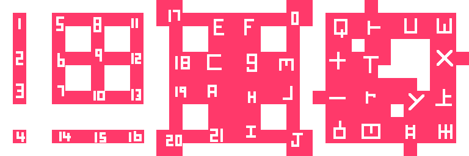

# Godot Tile Templates

Templates for Godot Autotiles.

# How to Use

1. Open the Godot 4 project.
2. Observe the tile maps that are wired up for autotiles.
3. Modify the tile map png images in Aseprite.
4. Examine the tilemaps in the editor to ensure all tiles are correct. 

# Images

## 16 Pixel Tiles

## 32 Pixel Tiles

## 64 Pixel Tiles

## 16 Pixel Tiles (with symbols)

